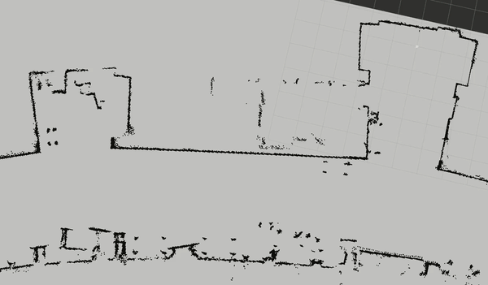
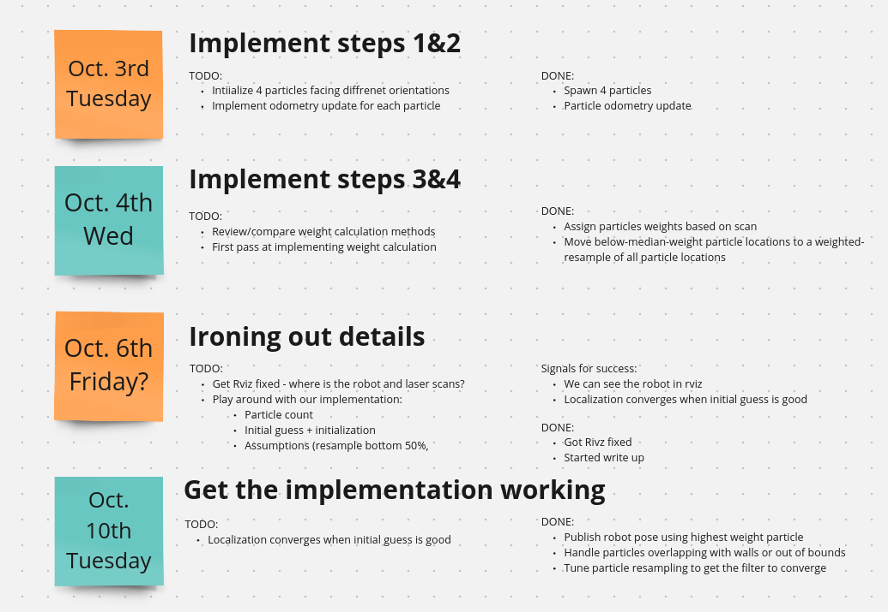

# Robot Localization

Team: Bill & Crane 

## Overview
The goal of this project was to create a particle filter to determine a robots location in a pre-built map. The algorithm uses lidar and odometry readings to provide a continually updating estimation of the robots location. 

The basis behind a particle filter, is that the algorithm randomly distributed particles around the pre-built map. The particles represent potential locations of the robots . The algorithm then moves the particles based on the odometry reading from the robot. Then using a weighting function based on the lidar readings from the robot, the algorithm determines the probability that each particle correctly represents the robot. Particles continue to be updated based on the robot readings and weight function. Here is an outline of the algorithm:
	
- Initialize a set of particles via random sampling
- Update the particles using data from odometry
- Reweight the particles based on their compatibility with the laser scan
- Resample with replacement a new set of particles with probability proportional to their weights.
- Update the estimate of the robot’s pose given the new particles. Update the map to odom transform.
## Algorithm
### Initialize Particles
To start the algorithm, particles need to be created and placed on the map. Each particle has an x, y coordinate, as well as an orientation given by a theta. We placed the particles on the origin of the prebuilt map and set their theta to be evenly distributed amongst 360 degrees. While they all start at the same place with an even weight, they get dispersed as soon as the robot starts moving since they all have different orientations. We choose to use 100 particles since we found lower numbers to be insufficient.
### Update particles to match robot movement
	
The second step in the particle filter algorithm is to move each particle according to the robot’s own movement, ie, if the robot drives forward and turns to its right, then every particle should do the same. This task is non-trivial because the displacement must be applied to each particle within its own body-frame. To perform this elegantly, we use pose matrices to represent the transformations.
Let us first define our notation. Let $g$ represent a pose vector $[ x \ y \ \theta]$. Each pose vector has a corresponding pose matrix $\hat{g}$ of the following form:

$$
\hat{g} = 
\begin{bmatrix}
\cos(\theta) & -\sin(\theta) & x \\
\sin(\theta) & \cos(\theta) & y \\
0 & 0 & 1
\end{bmatrix}
$$

Pose matrices are useful because they allow us to compose poses in their respective frames. Composing two poses $g_1$ and $g_2$ together via multiplying together their matrix representations $\hat{g}_1 * \hat{g_2}$ will give the transformation that is a combination of first transforming by g_1, and then applying g_2 from the new pose that g_1 transformed to.

For computing the odometry update of our particles, we are provided with odometry data of the new pose $g(t+1)$ in the odom frame, as well as the current pose $g(t)$. We are looking for a body-frame displacement $\Delta_t$ such that $\hat{g}(t) \circ \hat{\Delta}_t = \hat{g}(t+1)$ - Delta is a body-frame displacement because it’s multiplied on the right side. Using linear algebra, we find that $\hat{\Delta_t} = \hat{g}(t)^{-1} \circ \hat{g}(t+1)$. This pose matrix $\hat{\Delta_t}$ represents the change in robot pose relative to the initial pose of the robot.

To compute where each particle will be next if they each moved like the real robot, we will now apply this body-frame displacement to each particle. For each particle pose $g_i(t)$, we can multiply the pose on the right side by the body-frame transformation $\hat\Delta_t$ to find where the particle would be if it traveled like the robot. Thus, the new particle pose will be $\hat g_i(t+1) = \hat g_i(t) \circ \hat\Delta_t$ 

### Calculate Particle Weight
Every time the particles are moved, we can re-evaluate which particles are more likely to be good guesses for the robot pose. The metric that we use for calculating each particle’s weight is the absolute difference between each particle’s distance to its nearest obstacle point, and the real robot’s distance to its nearest obstacle point. 

	
We start the laser update by finding the minimum value of the laser scan ranges, which we use as the real robot’s distance to its closest obstacle. We then subtract from this value each particle’s distance to its closest obstacle, which we query through the provided ObstacleField function. Finally, we take the absolute value of these differences. This gives us a “distance error” value for each particle. 

We will now compute particle weights using this list of particle distance errors. Consider an example list of particle distance errors:

$$
e = 
\begin{bmatrix}
0.2 & 0.4 & 0.5 & 1 & 2 & 3
\end{bmatrix}
$$

We would like the weight of the particles to be inversely proportional to its distance error - the more dissimilar the particle’s distance to the real robot’s, the poorer the pose estimate and thus the lower its weight. Thus, we compute the weight by first taking the reciprocal of the distance errors, and then normalizing them by the sum of the reciprocals. For verification, we can test this reciprocal and normalization weighting function on the example errors::

$$
w = 1/e = 
\begin{bmatrix}
0.44 & 0.22 & 0.18 & 0.09 & 0.04 & 0.03
\end{bmatrix}
$$

This confirms that the particles whose closest distance more closely match the real robots’ will have a higher weight, and that all of the weights will sum to one. This concludes the description of our re-weighting function.

### Redistribute Particles based on Particle Weight
We decided to redistribute the bottom twenty percent of particles as determined by the weighting function. Twenty percent was found to best fit the map we were testing on and provide a good balance of leaving successful particles and inducing randomness. To add the particles back in, we wanted to give them all a chance to spawn in any of the current particle positions (including the position of the particles we just removed). We used the particle weights to create a weighted random function so that the redistributed particles would tend to go to the higher weighted positions.

To determine theta, we used the value of theta that had been randomly sampled and then randomly added or subtracted a value up to 45 degrees from the original theta. Initially, we made theta entirely random, but we noticed that 'correct' particles we wanted to follow often already had reasonably accurate orientations. Making the choice of theta entirely random introduced too much noise into the model. Varying theta slightly reduces the amount of noise introduced while still providing a degree of randomness.

### Compute Robot’s Position
We computed the robot position to match the highest weighted particle.	

## Challenges and Improvements

### Challenges
One of our team's greatest challenges was the logistics: Crane and I were both busy during the first week of the project, so practically we completed the project implementation within one week. This meant that while our meetings were all productive, we did not have time to dwell on any individual topic.

This was reflected in our incorrect weight calculation, and specifically in our  incorrect error metric. Our first idea was to compare the results of the "find closest obstacle distance" function of each particle with the real robot's shortest distance laser scan. We implemented this to get an MVP working, recognizing that it will be unable to weigh based on the particles' orientation and thus particles in the same position but different headings will all receive the same weight. This caused the "best particle" to constantly move in incorrect directions, creating an overall very jumpy state estimate whose orientation was usually wrong. Due to our time constraints, we were not able to devote more time to identifying a better a weighing algorithm.

### Improvements
One clear area for improvement is the weighing function. As Paul mentioned to us in class, the correct weighing function would transform the real laser scans into each particle's frame, and apply the "find closest obstacle distance" to all these particle-frame laser scans. The error residual would thus be the sum of how far away each of these particle-frame scans are from the obstacles: the correct particle's particle-frame scans would align perfectly with the map.

In a similar vein of improving-upon-MVP-algorithms, our initial seeding algorithm could be significantly improved. Because we did not consider if particles spawned in an area would be spawned in obstacles or impossible-to-reach spaces, we simply spawned all particles on the selected initial seed position, but with a uniform distribution of orientation. This makes our algorithm perform poorly when the initial guess is far away from the real initial position, as the particles are unlikely to stumble near the correct position and "discover" the truth. A better initial seeding algorithm would spawn particles in an area around the intiail guess, in order to be more robust to poor initial guesses.

### Learnings
 To manage our tight timeline, at the start of the project how many class periods and meetings we had, and worked backwards to determine project deliverables for each meeting. Having goals for each meeting helped us orient ourselves when we met, and it gave us something to measure against at the end of the meeting. Having a timeline also helped us determine when we needed to schedule additional meetings. Overall, the project timeline was very helpful for us.

## Team bonding
 We had a mani-pedi party :)